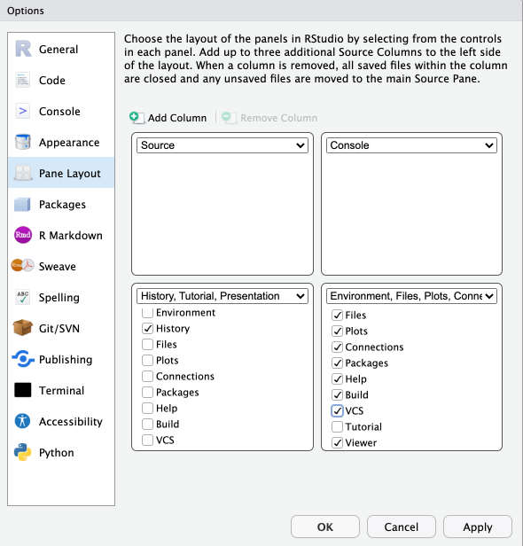
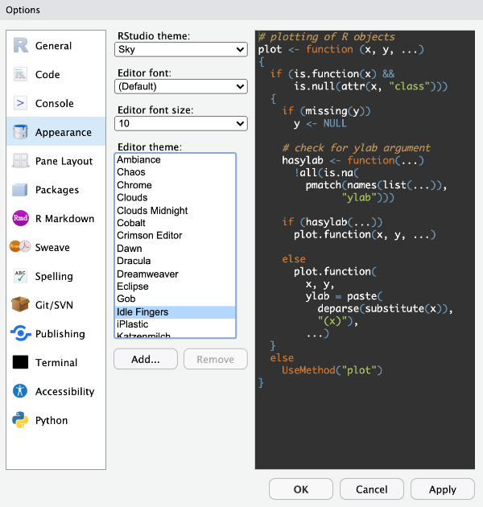
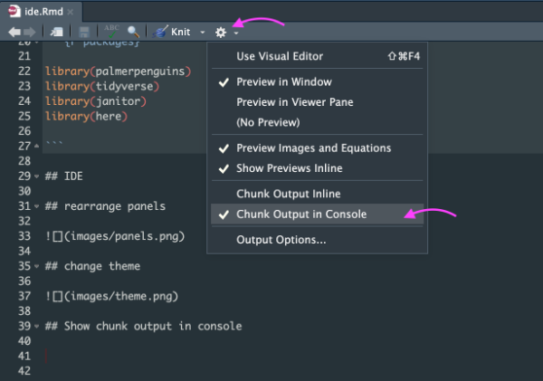
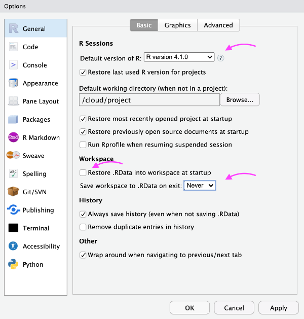
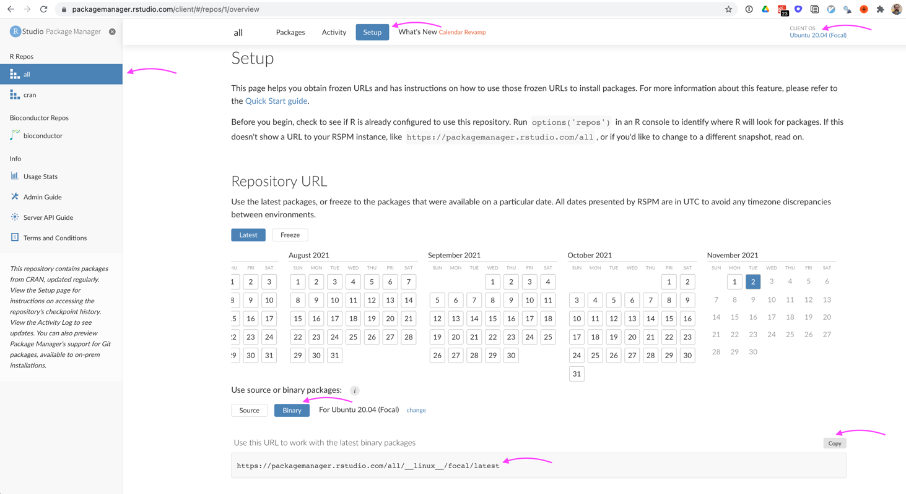
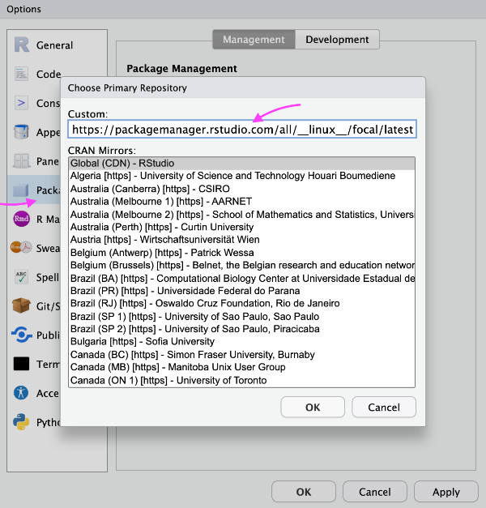
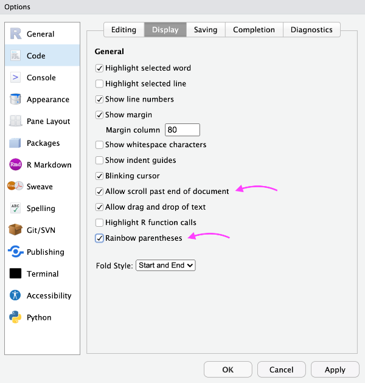
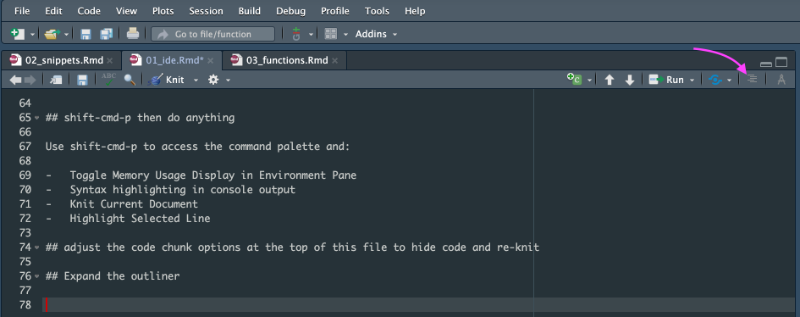
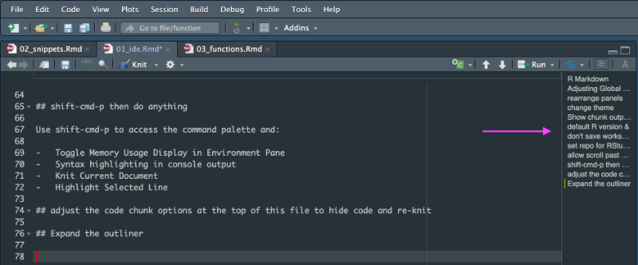
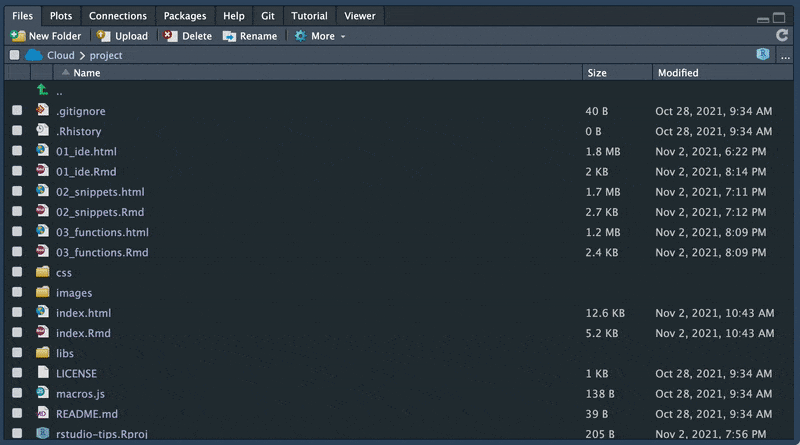

```{r setup, include=FALSE}
knitr::opts_chunk$set(echo = TRUE)
```

## R Markdown

This is an R Markdown document. Markdown is a simple formatting syntax for authoring HTML, PDF, and MS Word documents. For more details on using R Markdown see <http://rmarkdown.rstudio.com>.

When you click the **Knit** button a document will be generated that includes both content as well as the output of any embedded R code chunks within the document. You can embed an R code chunk like this:

```{r packages}

library(palmerpenguins)
library(tidyverse)
library(janitor)
library(here)

```

# Adjusting Global Options in the RStudio IDE

Pro tip: cmd-, to access global options

## rearrange panels



## change theme



## Show chunk output in console



## default R version &

## don't save workspace data



## set repo for RStudio Public Package Manager

Pro tip: If you are on a Linux server, see what operating system you are on by running this in your console:\
`system("lsb_release -a")`\
Then go to [RStudio Public Package Manager](https://packagemanager.rstudio.com/client/)





## allow scroll past end of doc & rainbow parentheses



## shift-cmd-p then do anything

Use shift-cmd-p to access the command palette and:

-   Toggle Memory Usage Display in Environment Pane
-   Syntax highlighting in console output
-   Knit Current Document
-   Highlight Selected Line

## adjust the code chunk options at the top of this file to hide code and re-knit

## Expand the outliner

Pro tip: Navigate your document with the outliner

\
\

## Outline is also down here

\

# git in the IDE

Pro tip: cmd-a to select all

In the git tab, click once on the row of the top item.\
Then, cmd-a to select them all. Then, check one box to check them all.

\
