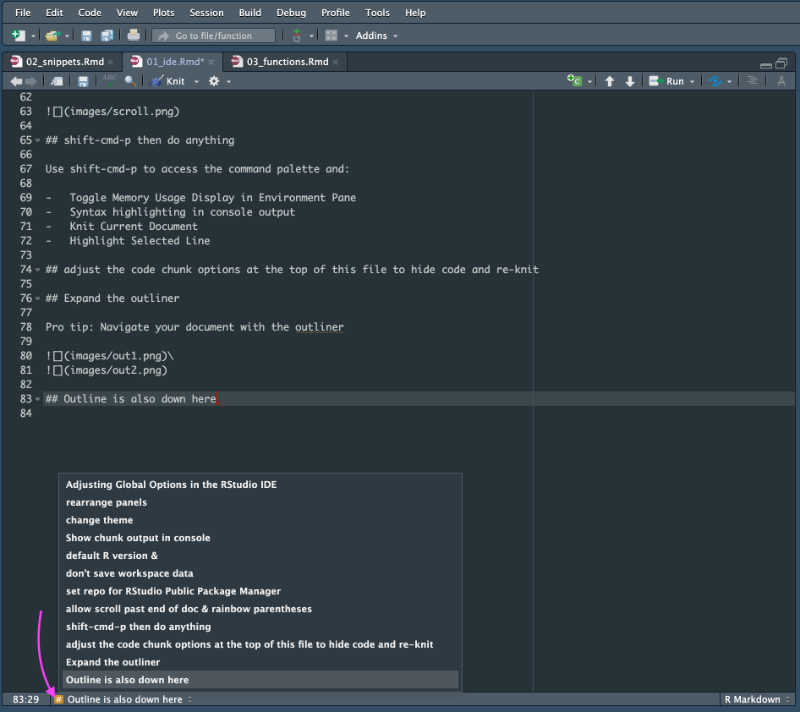
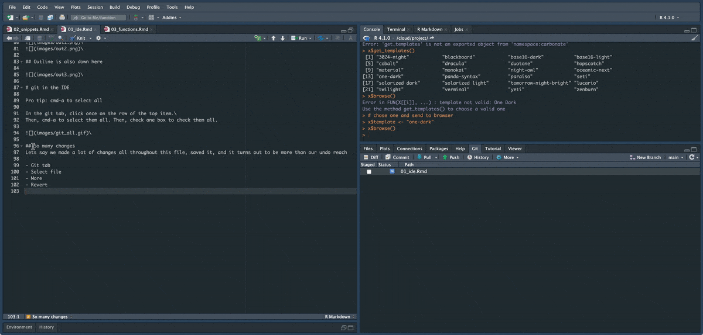

```{r setup, include=FALSE}
knitr::opts_chunk$set(echo = TRUE)
```

## Slides

[https://jeremy-allen.github.io/rstudio-tips/](https://jeremy-allen.github.io/rstudio-tips/)  


```{r packages}

library(palmerpenguins)
library(tidyverse)
library(janitor)
library(here)

```

# Adjusting Global Options in the RStudio IDE

Pro tip: cmd+, to access global options

## rearrange panels


## change theme


## Show chunk output in console


## default R version &

## don't save workspace data


## set repo for RStudio Public Package Manager

Pro tip: If you are on a Linux server, see what operating system you are on by running this in your console:\
`system("lsb_release -a")`\
Then go to [RStudio Public Package Manager](https://packagemanager.rstudio.com/client/)


## allow scroll past end of doc & rainbow parentheses


## shift+cmd+p then do anything

Use shift+cmd+p to access the command palette and:

-   Toggle Memory Usage Display in Environment Pane
-   Syntax highlighting in console output
-   Knit Current Document
-   Highlight Selected Line

## adjust the code chunk options at the top of this file to hide code and re-knit

## Expand the outliner

Pro tip: Navigate your document with the outliner

\
\

## Outline is also down here

\

# Code folding

Go back up to the line "## set repo for RStudio Public Package Manager"  
Click the little triangle next to the line number  

\

# git in the IDE

Pro tip: cmd+a to select all

In the git tab, click once on the row of the top item.\
Then, cmd+a to select them all. Then, check one box to check them all.

\

Pro tip: revert

\

Add a bunch text below and save the file

-   go to the git tab

-   select file

-   More

-   Revert
