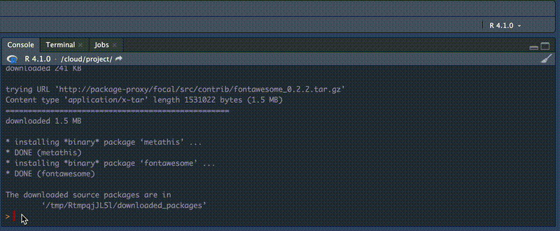

Slides for the RStudio Tips and Tricks Series are available

<https://jeremy-allen.github.io/rstudio-tps/>

------------------------------------------------------------------------

<br>\
<br>

```{r setup, include=FALSE}
knitr::opts_chunk$set(echo = TRUE)
```

```{r packages, echo=TRUE, message=FALSE, warning=FALSE}

library(palmerpenguins)
library(tidyverse)
library(janitor)
library(here)

```

# Before we dive in, two things

## Set preview in viewer pane


<br>

## Visual Editor will be our quick preview tool throughout this series


<br>

# Adjusting Global Options in the RStudio IDE

`r emo::ji("smile")` Pro tip: cmd+, to access global options

<br>

### Rearrange panels


<br>

### Change theme


<br>

### Show chunk output in console


<br>

### Default R version & don't save workspace data


<br>

### Set repo for RStudio Public Package Manager

`r emo::ji("smile")` Pro tip: If you are on a Linux server, see what operating system you are on by running this in your console: 

<br>

`system("lsb_release -a")`

<br>

Then go to [RStudio Public Package Manager](https://packagemanager.rstudio.com/client/)


<br>

## Allow scroll past end of doc & rainbow parentheses


<br>

## Command Palette is amazing!

`r emo::ji("smile")` shift+cmd+p then do anything

Use shift+cmd+p to access the command palette and:

-   Toggle Memory Usage Display in Environment Pane
-   Syntax highlighting in console output
-   Knit Current Document
-   Highlight Selected Line

<br>

## Adjust the code chunk options at the top of this file to hide code and re-knit

<br>

## Expand the outline

`r emo::ji("smile")` Pro tip: Navigate your document with the outline 

`r emo::ji("smile")` also ctl+shift+o

 

 

<br>

## Outline is also down here

\

<br>

# Code folding

Go back up to the line "set repo for RStudio Public Package Manager"\
`r emo::ji("smile")` Click the little triangle next to the line number

\

<br>

# Command History in the console

`r emo::ji("smile")` Pro tip: in the console type a couple of letters then cmd+up for visual of matches

 

<br>

# Open File in New Column

`r emo::ji("smile")` Pro tip: open file in new column is great for Shiny apps when you have ui, sever, and css files

\

<br>

# Comment and not

`r emo::ji("smile")` Pro tip: highlight multiple lines of code, shift+ctl+c to comment all


<br>

# Move line

`r emo::ji("smile")` Pro tip: alt+up or alt+down to move lines


<br>

# Multi-line

`r emo::ji("smile")` Pro tip: ctl+alt+down or ctl+alt+up to have multi-line cursor\
You try: add commas after starts_with() and mean

```{r echo=TRUE, eval=FALSE}

df %>% 
  summarise(
    across(
      starts_with("culmen")
      mean
      na.rm = TRUE
      )
    )

```


<br>

# Which parentheses?

`r emo::ji("smile")` Pro tip: double click one of the parentheses to highlight what it contains

```{r echo=TRUE, eval=FALSE}


div(
  class = "outer",
  div(
    class = "container",
    div(class = "data",
        df %>% 
          filter(
            str_detect(Species, "Chin"),
            Sex == "MALE",
            Island == "Dream"
          ) %>% 
          summarise(
            across(
              starts_with("culmen"),
              mean,
              na.rm = TRUE
            )
          )
    )
  )
)

```


<br>

# git in the IDE (a very short intro)

`r emo::ji("smile")` Pro tip: ctl+alt+m to open the commit window\
`r emo::ji("smile")` Pro tip: can stage or discard chunks, even lines  
`r emo::ji("smile")` Pro tip: select first file then cmd+a to highlight all, then check one to check all


<br>

[more on git in RStudio](https://r-pkgs.org/git.html#git-rstudio)
