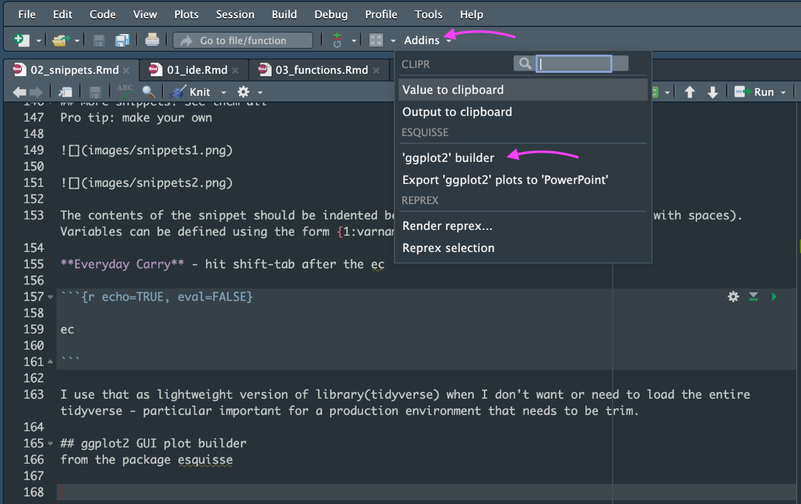
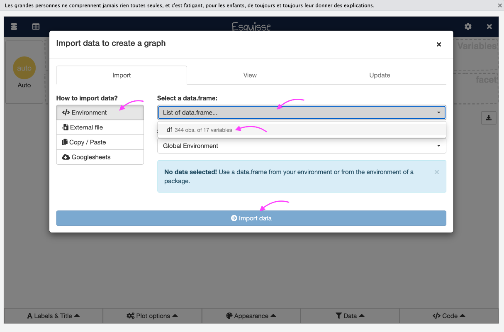
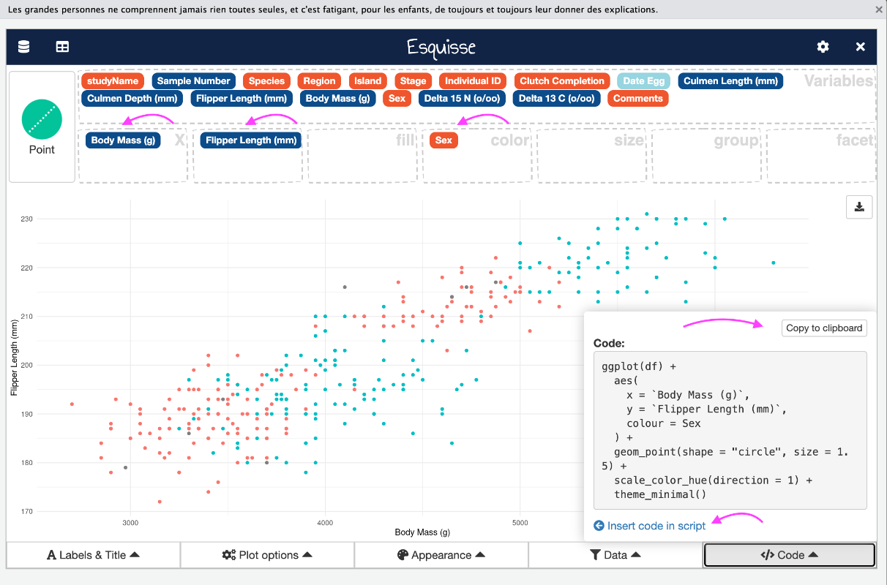

# Snippets! How do they work?

First, let's prep some data

```{r packages, message=FALSE, warning=FALSE, include=FALSE}

library(palmerpenguins)
library(tidyverse)
library(janitor)
library(here)

```

## Get data from the palmerpenguins package and inspect names

```{r}

df <- penguins_raw

df

# gross!
names(df)

# clean those names
df %>% 
  clean_names() %>% 
  names()

```

## How about those column names?

A little regex first\
Pro tip: match anything that you put in []

```{r}

# are there spaces or capital letters in col names?
str_detect(names(df), "[\\sA-Z()/-]")
# but we only want one answer, so wrap in any()
any(str_detect(names(df), "[\\sA-Z()/-]"))

```

Pro tip: str_view() to see string matches (requires htmlwidgets)

```{r}

# let's see where our pattern matches
str_view_all(names(df), "[\\sA-Z()/-]")

```

# Finally, a snippet!

Pro tip: cmd-i to fix bad indentation

```{r}

# snippet time! type "if" then hit shift-tab
# paste in our regex condition and our clean_names code


# highlight the if statement above then hit cmd-I to fix the indentation

# inspect
names(df)

```

## What will this return now? Someone tell me before runnig it!

```{r}

any(str_detect(names(df), "[\\sA-Z()/-]"))

```

## Can we pipe that? Yes we can.

Pro tip: cmd-shift-m to insert pipe

```{r}

names(df) %>% 
  str_detect("[\\sA-Z()/-]") %>% 
  any()

```

## Assign the clean names

Pro tip: alt-(dash) for assignment arrow

```{r}

df <- df %>% 
  clean_names()

```

## More snippets! Functions

Pro tip: type fun then hit shift-tab\
Pro tip: cmd-f for find (and replace)

```{r echo=TRUE, eval=FALSE}

# type fun then hit shift-tab
# name it clean_if_bad_names
# one arg called x
# put our if statement in the body
# cmd-i to fix indent
# cmd-f to change df to x


# reset df
df <- penguins_raw

clean_if_bad_names(x = df)

```

## More snippets! For loops

```{r}

# type for then hit shift-tab


```

## More snippets! See them all

Pro tip: make your own


The contents of the snippet should be indented below using the <tab> key (rather than with spaces). Variables can be defined using the form {1:varname}.

**Everyday Carry** - hit shift-tab after the ec

```{r echo=TRUE, eval=FALSE}

ec

```

I use that as lightweight version of library(tidyverse) when I don't want or need to load the entire tidyverse - particular important for a production environment that needs to be trim.

## ggplot2 GUI plot builder

from the package esquisse 




