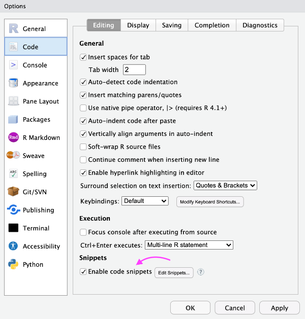
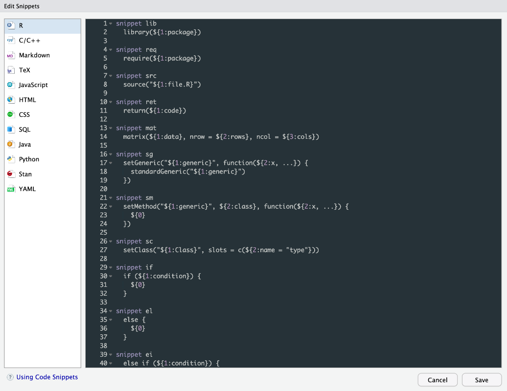
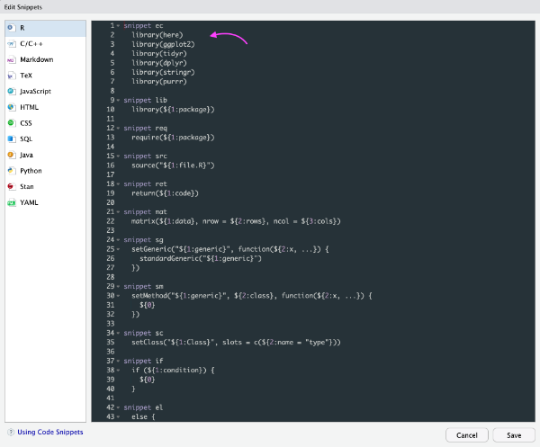
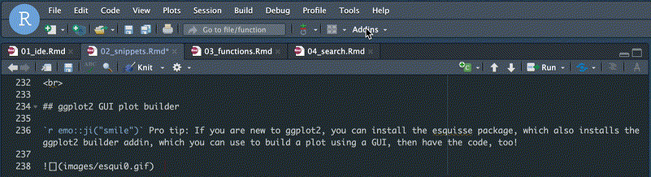
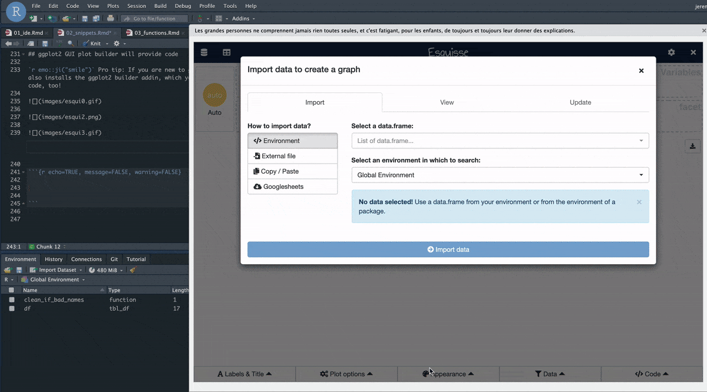

------------------------------------------------------------------------

<br>\
<br>

# Review

-   shift+cmd+p for command palette
-   shift+cmd+m for pipe
-   alt-dash for assignment
-   cmd+, for global options
-   how do we fold code?

<br>

# Snippets! How do they work?

First, let's prep some data

```{r packages, message=FALSE, warning=FALSE, include=FALSE}

library(palmerpenguins)
library(tidyverse)
library(janitor)
library(here)

```

<br>

## Get data from the palmerpenguins package and inspect names

```{r}

df <- penguins_raw

df

# gross!
names(df)

# clean those names
df %>% 
  clean_names() %>% 
  names()

```

<br>

## How about those column names?

A little regex first\
`r emo::ji("smile")` Pro tip: match anything that you put in []

```{r}

# are there spaces or capital letters in col names?
str_detect(names(df), "[\\sA-Z()/-]")
# but we only want one answer, so wrap in any()
any(str_detect(names(df), "[\\sA-Z()/-]"))

```

`r emo::ji("smile")` Pro tip: str_view() to see string matches (requires htmlwidgets)

```{r}

# let's see where our pattern matches
str_view_all(names(df), "[\\sA-Z()/-]")

```

<br>

# Finally, a snippet!

`r emo::ji("smile")` Pro tip: cmd+i to fix bad indentation

```{r}

# snippet time! type "if" then hit shift+tab
# paste in our regex condition and our clean_names code

# try yours right below here:


# should look like this when you're done
if (any(str_detect(names(df), "[\\sA-Z()/-]"))) {
  df <- df %>% 
  clean_names()
}

# highlight the if statement above then hit cmd+i to fix the indentation

# inspect
names(df)

```

<br>

## What will this return now? Someone tell me before running it!

```{r}

any(str_detect(names(df), "[\\sA-Z()/-]"))

```

<br>

## Can we pipe that? Yes we can. Inside to outside.

`r emo::ji("smile")` Pro tip: cmd+shift+m to insert pipe

```{r}

names(df) %>% 
  str_detect("[\\sA-Z()/-]") %>% 
  any()

```

<br>

## Assign the clean names

`r emo::ji("smile")` Pro tip: alt+dash for assignment arrow

```{r echo=TRUE, eval=FALSE}

df <- df %>% 
  clean_names()

```

<br>

## More snippets! Functions

`r emo::ji("smile")` Pro tip: type fun then hit shift+tab\
`r emo::ji("smile")` Pro tip: cmd+f for find (and replace)

```{r echo=TRUE, eval=FALSE}

# type fun then hit shift+tab
# name it clean_if_bad_names
# one arg called x
# put our if statement in the body
# cmd+i to fix indent
# cmd+f to change df to x

# try yours right below here:


# should look like this when you are done
clean_if_bad_names <- function(x) {
  if (any(str_detect(names(x), "[\\sA-Z()/-]"))) {
    x <- clean_names(x)
    x
  }
  x
}


# reset our df back to original with bad column names
df <- penguins_raw

# use our new function
df <- clean_if_bad_names(x = df)

```

<br>

## More snippets! For loops

```{r echo=TRUE, eval=FALSE}

# type for then hit shift+tab:


```

<br>

## More snippets! See them all

`r emo::ji("smile")` Pro tip: make your own





The contents of the snippet should be indented below using the <tab> key (rather than with spaces). Variables can be defined using the form {1:varname}.

Make a snippet called ec with the following lines

library(here)  
library(ggplot2)  
library(tidyr)  
library(dplyr)  
library(stringr)  
library(purrr)  

\
<br>

**Everyday Carry** - hit shift+tab after the ec below

```{r echo=TRUE, eval=FALSE}

ec

```

I use that as lightweight version of library(tidyverse) when I don't want or need to load all core tidyverse packages - particularly important for a production environment that needs to be trim.

<br>

## ggplot2 GUI plot builder will provide code

`r emo::ji("smile")` Pro tip: If you are new to ggplot2, you can install the esquisse package, which also installs the ggplot2 builder addin, which you can use to build a plot using a GUI, then have the code, too!

  

<br>

### Before you start, click in the code chunk below, then go to the Addins and build your plot. When you clik to insert code it will be inserted where you cliked last in your script

  

```{r echo=TRUE, message=FALSE, warning=FALSE}

# click below here before starting the esquisse addin


```

