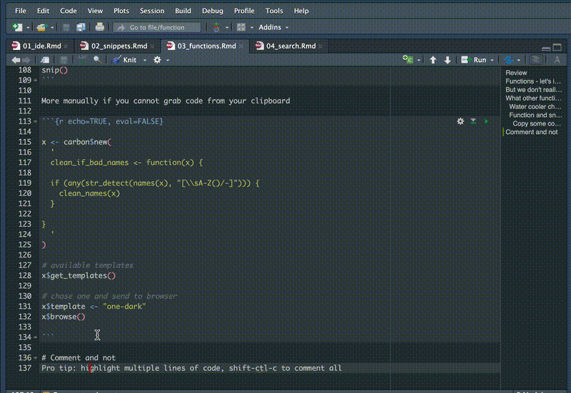
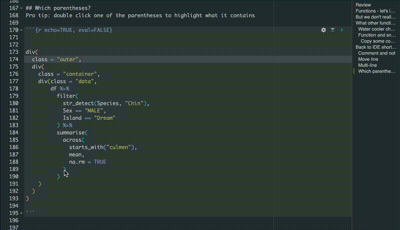

---

<br>  
<br>  

```{r packages, message=FALSE, warning=FALSE, include=FALSE}

library(palmerpenguins)
library(tidyverse)
library(janitor)
library(here)

```

# Review

- we made a new function - clean_if_bad_names()
- shift+cmd+p for command palette
- fun/if/for/lib/ec then shift+tab to add snippets
- esquisse addin to generate plot code if new to ggplot2
- alt+dash for assignment arrow 
- cmd+up in console to see history

# Functions - let's inspect!

```{r }

clean_if_bad_names <- function(x) {
  if (any(str_detect(names(x), "[\\sA-Z()/-]"))) {
    x <- clean_names(x)
    x
  }
  x
}

# reset df
df <- penguins_raw

clean_if_bad_names(x = df)

```

<br>

# But we don't really need that silly function

clean_names() from the janitor package looks for more bad elements in names\
How do we know?\
`r emo::ji("smile")` Pro tip: cmd+click on the function name below

```{r echo=TRUE, eval=FALSE}

janitor::clean_names()

```


```{r}

# we don't really need to test first, just clean the column names
df <- penguins_raw %>% janitor::clean_names()

```

\

Select the data.frame method from the drop down 

Then cmd click the internal function make_clean_names()\


Now we see the internals on janitor's make_clean_names(), we see it cleans up apostrophes and other things our function didn't.\


<br>

# What other functions do you want to inspect?

```{r echo=TRUE, eval=FALSE}

dplyr::arrange()

```

<br>

## Water cooler chat: Chunk options in gear icon

In the chunk above, the options in the gear icon do not provide a way for:\
`{r echo=TRUE, eval=FALSE}`\
which means to show the code but do not run the code.

<br>

## Function and snippet mashup
`r emo::ji("smile")` combine some functions into one function using purrr::compose()  

```{r}

not_in <- purrr::compose( # by default it runs bottom to top
  `!`,
  `%in%`
)

```


```{r}

not_in(3, c(1:2))
not_in(1, c(1:2))
not_in("January", month.name)

```

```{r compose, message=FALSE, warning=FALSE}
library(broom)
library(gt)

lm_peek <- purrr::compose(
  .dir = "forward",
  lm,
  broom::tidy,
  gt::gt,
  ~tab_header(.x, title = "Results Preview")
)

# this
lm_peek(culmen_depth_mm ~ flipper_length_mm + body_mass_g, data = df)

```

<br>  

# Back to IDE shortcuts for a moment

## Comment and not
`r emo::ji("smile")` Pro tip: highlight multiple lines of code, shift-ctl-c to comment all  



<br>  

## Move line
`r emo::ji("smile")` Pro tip: alt+up or alt+down to move lines  

  

<br>  

## Multi-line
`r emo::ji("smile")` Pro tip: ctl+alt+down or ctl+alt+up to have multi-line cursor  
You try: add commas after starts_with() and mean  

```{r echo=TRUE, eval=FALSE}

df %>% 
  summarise(
    across(
      starts_with("culmen")
      mean
      na.rm = TRUE
      )
    )

```

  

<br>  

## Which parentheses?
`r emo::ji("smile")` Pro tip: double click one of the parentheses to highlight what it contains  

```{r echo=TRUE, eval=FALSE}


div(
  class = "outer",
  div(
    class = "container",
    div(class = "data",
        df %>% 
          filter(
            str_detect(Species, "Chin"),
            Sex == "MALE",
            Island == "Dream"
          ) %>% 
          summarise(
            across(
              starts_with("culmen"),
              mean,
              na.rm = TRUE
            )
          )
    )
  )
)

```

  
<br>  

# Back to functions!

## Got code?
Pro tip: highlight code, then in Code menu, select extract function
```{r echo=TRUE, eval=FALSE}

# in the code menu, select extract function

df %>% 
    filter(
      Sex == "MALE"
      ) %>% 
    summarise(
      mean_body_mass = mean(`Body Mass (g)`, na.rm = TRUE)
    )

```

