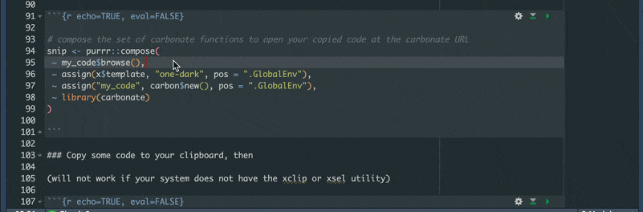

```{r packages, message=FALSE, warning=FALSE, include=FALSE}

library(palmerpenguins)
library(tidyverse)
library(janitor)
library(here)

```

# Review

- shift+cmd+p for command palette
- fun/if/for/lib/ec then shift+tab to add snippets
- esquisse add-in to generate plot code in a GUI
- alt-dash for assignment  
- cmd+up in console to see history

# Functions - let's inspect!

```{r }

clean_if_bad_names <- function(x) {
  
  if (any(str_detect(names(x), "[\\sA-Z()/-]"))) {
    clean_names(x)
  }
  
  x
  
}

# reset df
df <- penguins_raw

clean_if_bad_names(x = df)

```

# But we don't really need that silly function

clean_names() from janitor looks for more bad elements in names\
How do we know?\
Pro tip: cmd-click on the function name below

```{r echo=TRUE, eval=FALSE}

janitor::clean_names()

```

\

Select the data.frame method from the drop down 

Then cmd click the internal function make_clean_names()\


Now we see the internals on janitor's make_clean_names(), we see it cleans up apostrophes and other things our function didn't.\


# What other functions do you want to inspect?

```{r echo=TRUE, eval=FALSE}

dplyr::arrange()

```

## Water cooler chat: Chunk options in gear

In the chunk above, the options in the gear icon do not provide a way for:\
`{r echo=TRUE, eval=FALSE}`\
which means to show the code but do not run the code. Am I missing something?

## Function and snippet mashup

Have you seen people post these cool images of their code:   

The [carbonate package](https://github.com/yonicd/carbonate) makes those.\
We are going to combine some carbonate functions into one function using purrr::compose()

```{r echo=TRUE, eval=FALSE}

# compose the set of carbonate functions to open your copied code at the carbonate URL
snip <- purrr::compose(
 ~ my_code$browse(),
 ~ assign(x$template, "one-dark", pos = ".GlobalEnv"),
 ~ assign("my_code", carbon$new(), pos = ".GlobalEnv"),
 ~ library(carbonate)
)

```

### Copy some code to your clipboard, then

(will not work if your system does not have the xclip or xsel utility)

```{r echo=TRUE, eval=FALSE}
snip()
```

More manually if you cannot grab code from your clipboard

```{r echo=TRUE, eval=FALSE}

x <- carbon$new(
  '
  clean_if_bad_names <- function(x) {

  if (any(str_detect(names(x), "[\\sA-Z()/-]"))) {
    clean_names(x)
  }

}
  '
)

# available templates
x$get_templates()

# chose one and send to browser
x$template <- "one-dark"
x$browse()

```

# Back to IDE shortcuts for a moment

## Comment and not
Pro tip: highlight multiple lines of code, shift-ctl-c to comment all  


## Move line
Pro tip: alt+up or alt+down to move lines  

  

## Multi-line
Pro tip: ctl+alt+down or ctl+alt+up to have multi-line cursor  
You try: add commas after starts_with() and mean  

```{r echo=TRUE, eval=FALSE}

df %>% 
  summarise(
    across(
      starts_with("culmen")
      mean
      na.rm = TRUE
      )
    )

```

  

## Which parentheses?
Pro tip: double click one of the parentheses to highlight what it contains  

```{r echo=TRUE, eval=FALSE}


div(
  class = "outer",
  div(
    class = "container",
    div(class = "data",
        df %>% 
          filter(
            str_detect(Species, "Chin"),
            Sex == "MALE",
            Island == "Dream"
          ) %>% 
          summarise(
            across(
              starts_with("culmen"),
              mean,
              na.rm = TRUE
            )
          )
    )
  )
)

```

  

