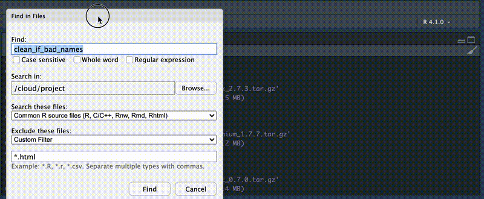

```{r packages, echo=TRUE, message=FALSE, warning=FALSE}

library(palmerpenguins)
library(tidyverse)
library(janitor)
library(here)

```

# Review

-   shift+cmd+p for command palette
-   fun/if/for/lib/ec then shift+tab to add snippets
-   cmd+click a function to inspect it, recursively

### cmd+click on the library function above

moving on...

# Search

## Search tabs

Pro tip: ctl+. to search file tabs


## Find in Files

Pro tip: shift+cmd+f to search within file, also under Edit menu

-   common R files
-   exclude \*.html


## Now you - Replace with "clean_my_bad_names"



# Google Programmable Search Engine

[Google Programmable Search Engine](https://programmablesearchengine.google.com/about/)  

I've already made this one <https://cse.google.com/cse?cx=e1ab735d551d64cb1> that searches just the following RStudio sites:  

- <https://blog.rstudio.com/>
- <https://education.rstudio.com/blog/>
- <https://blogs.rstudio.com/ai/>
- <https://www.tidyverse.org/blog/>
- <https://support.rstudio.com/hc/en-us/>
- <https://solutions.rstudio.com/>
- <https://docs.rstudio.com/>

\
  


