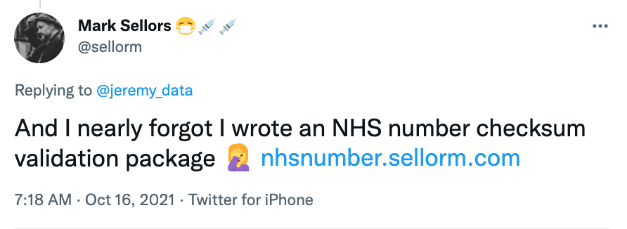
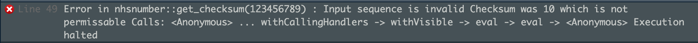

<https://nhsnumber.sellorm.com/>



```{r packages, message=FALSE, warning=FALSE, include=FALSE}

library(nhsnumber)

```

## Check validity

```{r}

x <- c(9876543210, 1234567890, 1234567881)

nhsnumber::is_valid(x)

```

## Get checksum

```{r}

nhsnumber::get_checksum(123456788)

```

## Full output

```{r}

nhsnumber::get_checksum(123456788, full_output = TRUE)

```

## Bad numbers

```{r echo=TRUE, eval=FALSE}

nhsnumber::get_checksum(123456789)

```


