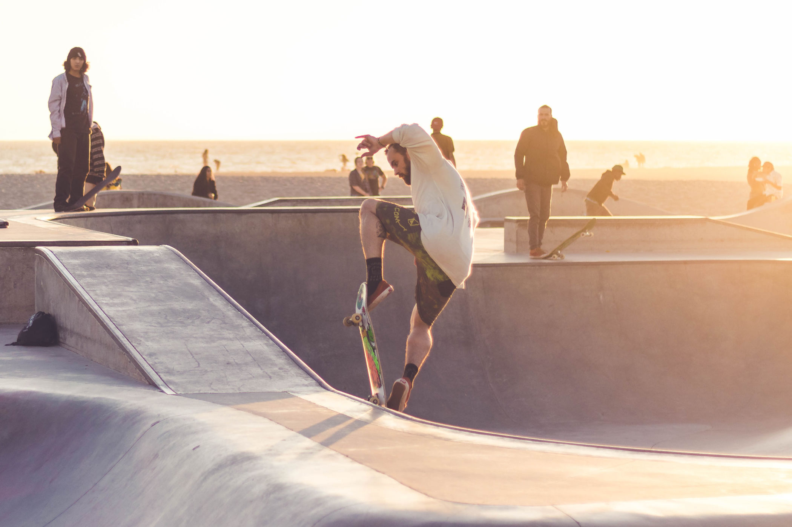

```{r setup, include=FALSE}
library(connectwidgets)
library(dplyr)
library(stringr)

knitr::opts_chunk$set(echo = FALSE, message = FALSE, warning = FALSE)

client <- connect(
  server  = Sys.getenv("rsc_server"),
  api_key = Sys.getenv("rsc_reports_api_key")
  )

all_content <- client %>%
  content()

tips <- all_content %>%
  filter(
    owner_username == "jeremy.allen",
    str_detect(name, "^tips.*")
  ) %>% 
  arrange(name)
```


Photo by Nadine Shaabana https://unsplash.com/photos/kH2AV7xZQj4  

<br>
<br>

```{r cards}
tips %>%
  rsc_card()
```


<br>

------------------------------------------------------------------------

Slides for the RStudio Tips and Tricks Series:  

<https://jeremy-allen.github.io/rstudio-tps/>  

Code:  

<https://github.com/jeremy-allen/rstudio-tips>

------------------------------------------------------------------------

Originally delivered as a workshop at the NHS-R Conference 2021